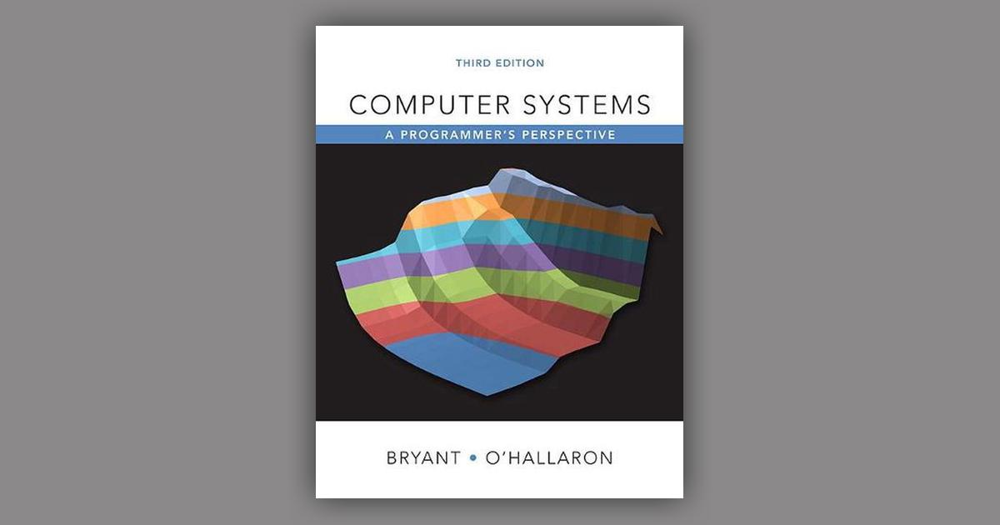

## Computer Systems: A Programmer's Perspective – Lab Assignments




Welcome to the repository for the book "Computer Systems: A Programmer's Perspective." This repository contains all the necessary instructions to set up your development environment and start working on the labs.

## Setup
To get started, follow these steps:
1. Download the Docker image by running the following command:
```docker pull xieguochao/csapp```
2. Run the Docker container using the following command:
```docker run -p 7777:7777 -v "$PWD/labs:/home/csapp/project"```
3. Use this repo as a template and clone your repo to ``/home/csapp/project``:
4. Open the browser and navigate to http://localhost:7777 (password: csapp) to access the environment.
5. If you prefer to use Visual Studio Code, make sure you have the Docker extension installed. Then, open command center and find "Dev Containers: Attach to Running Container..."

## Resources
- [Student site](http://csapp.cs.cmu.edu/3e/students.html)
- [Video Lectures](https://scs.hosted.panopto.com/Panopto/Pages/Sessions/List.aspx#folderID=%22b96d90ae-9871-4fae-91e2-b1627b43e25e%22)

## Lab Assignments
Track your progress through the labs by checking the boxes below:
- [ ] Data Lab
- [ ] Bomb Lab
- [ ] Attack Lab
- [ ] Cache Lab
- [ ] Shell Lab
- [ ] Malloc Lab
- [ ] Proxy Lab

Good luck with your programming journey! If you have any questions or issues, feel free to reach out.
